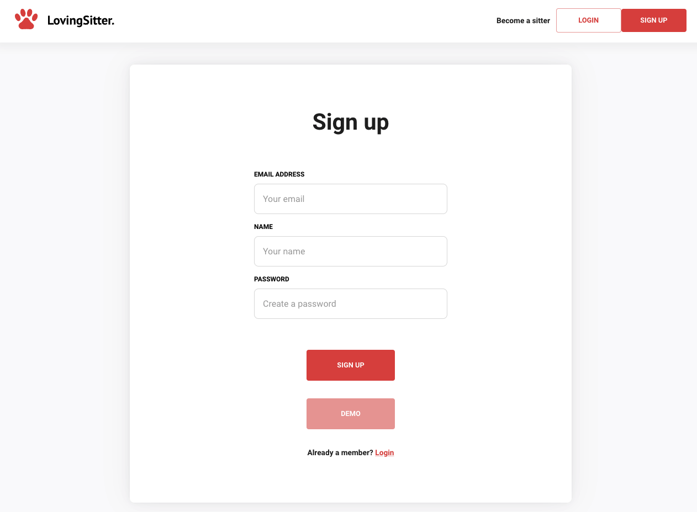
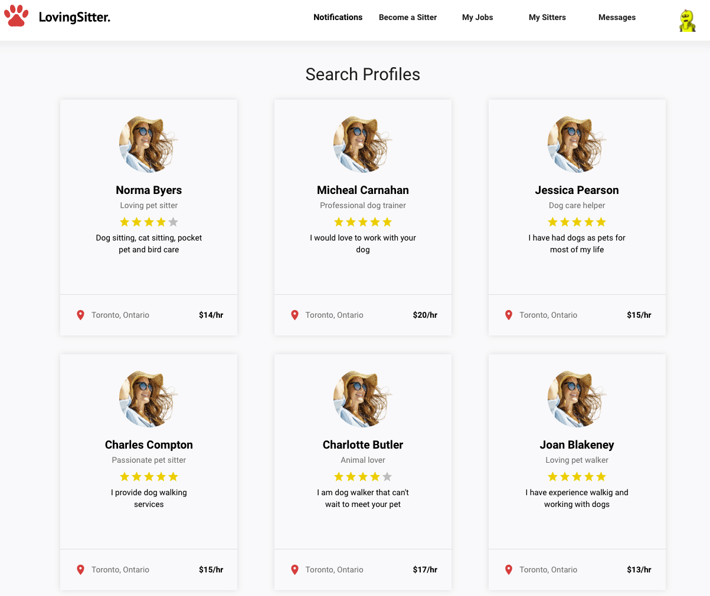
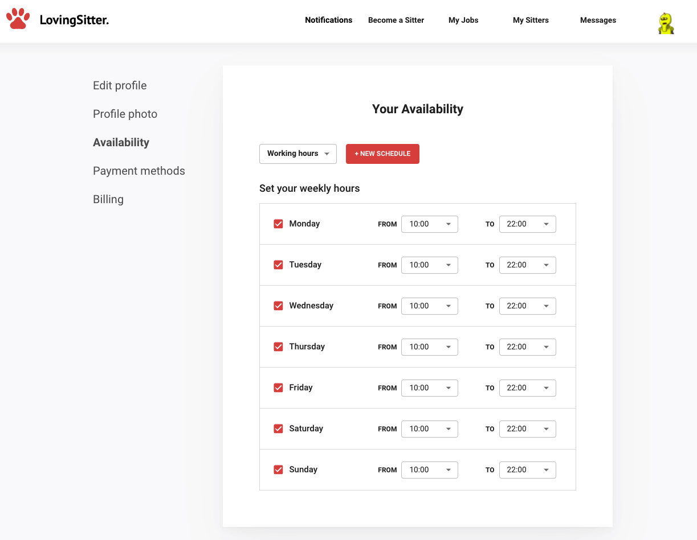
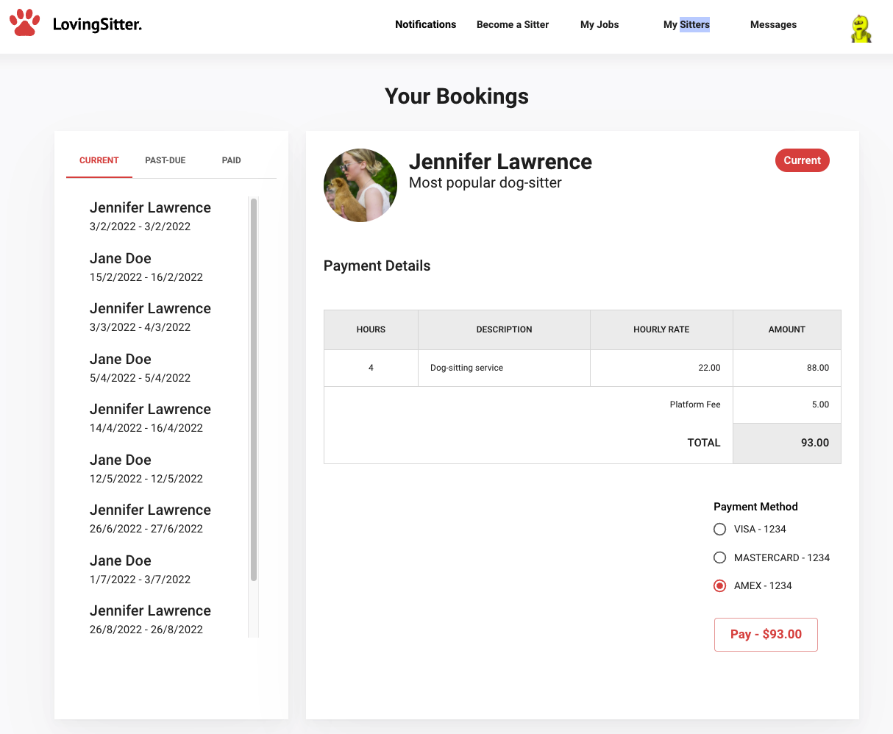

## Loving Sitter

A web application to connect pet owners (who need help finding a sitter for their dogs) and pet sitters (who are looking for cute dogs to take care of, and make some cash along the way).

**Tech Stack:** React.js / Material-UI, TypeScript, Express.js, Node.js, MongoDB, Stripe, Cloudinary

**Contributors**: [Ahmad Habib](https://github.com/Habib-Ahmad), [Rizki Perdana](https://github.com/rizperdana), [Chad Napper](https://github.com/ChadNaps), [Crystal Li](https://github.com/cl-codes)

---

### Getting Started

1. Clone or download repository

---

### Tests

#### Server Tests

1. Go into the server directory `cd server`
2. Execute tests
   1. Standard `npm test`
   2. Coverage `npm run coverage`

---

## Server

1. Go into the server directory `cd server`
2. Run `npm install` to install packages
3. Create your environment variable (.env) file
4. Run `npm run seeds` to create the demo user account and profile
5. Run `npm run dev` to start the server

---

## Client

1. Go into the client directory `cd client`
2. Run `npm install` to install packages
3. Run `npm start` to start the client side

---

### Demo

1. Sign up. Users will be able to create a new account using their email, name, and password. There is also a 'demo' option which does not require login.

2. Dashboard. Once logged in, users can view potential pet sitters. Clicking on each card will lead to their profiles and booking pages.

3. Availability. Pet sitters can update and set their availability schedules for pet owners to see.

4. Payments. Pet owners can view and pay invoices for upcoming and past bookings.

